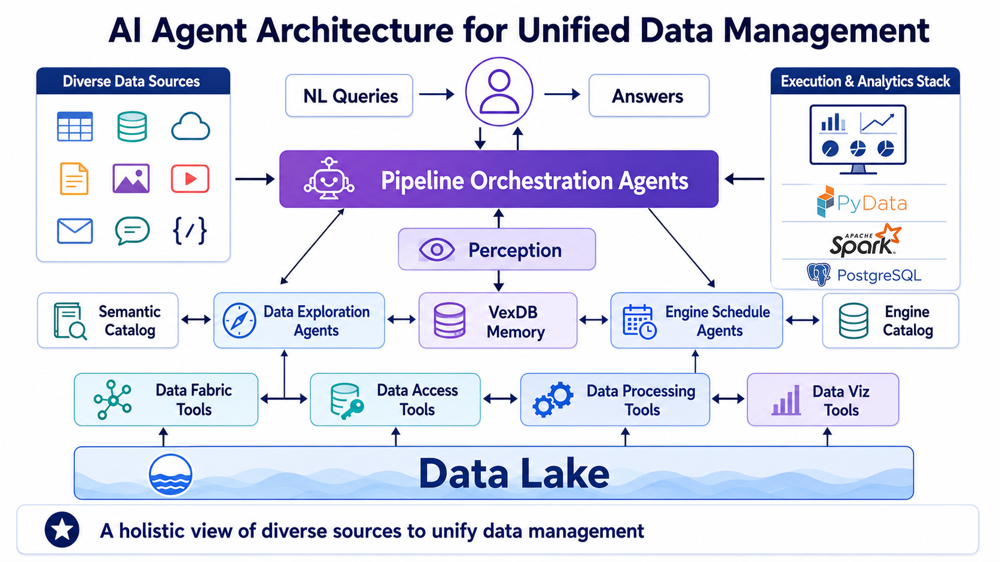
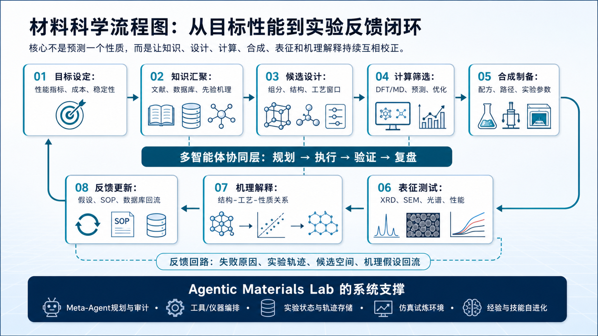

<div align="center">

# Draw.io Slide Reconstruction Skill

**A Codex skill for reconstructing presentation-style diagrams into editable Draw.io files.**

[](https://arxiv.org/abs/2605.15677)
[](https://huggingface.co/datasets/sxy1620348809/VCG-Bench)

</div>

This repository contains a Codex skill and helper scripts for converting slide-style diagram screenshots into editable `.drawio` files. It is the practical reconstruction workflow used in the VCG-Bench release examples: an agent inspects a reference image, creates a visible-element inventory, rebuilds text and structure with Draw.io primitives, uses crops or SVG where appropriate, exports a PNG preview, and verifies the result.

The companion benchmark repository is prepared separately as `VCG-Bench`. Add the final GitHub link here after the private repository URL is confirmed.

## What Is Included

| Path | Purpose |
|---|---|
| `SKILL.md` | The Codex skill instructions. This is the file Codex reads when the skill is installed. |
| `scripts/batch_manifest.py` | Build a manifest for a folder of input images. |
| `scripts/batch_verify.py` | Validate a batch of `.drawio` outputs and exported previews. |
| `scripts/check_drawio.py` | Check `.drawio` XML structure, embedded images, and common reconstruction issues. |
| `scripts/export_drawio.py` | Export `.drawio` files to PNG using Draw.io Desktop/CLI. |
| `scripts/crop_assist.py` | Assist with extracting image crops from complex reference diagrams. |
| `agents/openai.yaml` | Example agent configuration metadata. |
| `examples/` | Example reconstructed `.drawio` files. |
| `assets/` | README case images. |

## Reconstruction Cases

The examples below show one-round Codex + skill reconstruction outputs. The left image is the original diagram, and the right image is the exported PNG from the reconstructed `.drawio` file.

<table>
  <tr>
    <th width="50%">Original</th>
    <th width="50%">Reconstructed Draw.io Export</th>
  </tr>
  <tr>
    <td></td>
    <td></td>
  </tr>
  <tr>
    <td></td>
    <td></td>
  </tr>
  <tr>
    <td></td>
    <td></td>
  </tr>
</table>

Example editable outputs are available at:

```text
examples/data_lake.drawio
examples/data_man.drawio
examples/data_sci2.drawio
```

## Installation As A Codex Skill

Copy or symlink this repository into your Codex skills directory:

```bash
mkdir -p ~/.codex/skills
ln -s /path/to/drawio-slide-reconstruction ~/.codex/skills/drawio-slide-reconstruction
```

Then ask Codex to use `drawio-slide-reconstruction` for a diagram image or a folder of images.

## Requirements

- Codex or another agent that can follow `SKILL.md`.
- Python 3.10+ for the helper scripts.
- Draw.io Desktop/CLI for exporting `.drawio` files to PNG.

macOS:

```bash
brew install --cask drawio
```

Ubuntu/Debian:

```bash
sudo apt update
sudo apt install drawio
```

If Draw.io is not auto-detected, pass the executable path to scripts that support it or set `DRAWIO_PATH`.

## Batch Workflow

Create a manifest for a folder of images:

```bash
python scripts/batch_manifest.py path/to/images --output-dir path/to/output --write
```

For each manifest entry, the agent should create:

```text
<stem>.drawio
<stem>.png
<stem>.audit.md
```

Verify the batch:

```bash
python scripts/batch_verify.py path/to/output/drawio_batch_manifest.json
```

Export a single `.drawio` file:

```bash
python scripts/export_drawio.py examples/data_lake.drawio --output examples/data_lake.png
```

Check a `.drawio` file:

```bash
python scripts/check_drawio.py examples/data_lake.drawio
```

## Reconstruction Principles

The skill prioritizes visual fidelity to the reference image. It uses native Draw.io elements for editable text and structure, SVG or native shapes for simple icons, and image crops for complex, style-specific, or scene-like visual elements. Completion requires visual comparison against the reference, not only successful XML export.

Key quality gates:

- Every visible element should be inventoried before final delivery.
- Text and structural geometry should remain editable when practical.
- Complex artwork should be cropped or carefully repaired instead of replaced by generic icons.
- Exported PNG previews must be inspected for missing elements, crop seams, blur, and layout drift.
- The audit file should record unresolved defects instead of claiming perfect reconstruction.

## Relation To VCG-Bench

VCG-Bench studies visual-centric structured generation and editing with `mxGraph` XML. This skill is a practical agent workflow for one part of that problem: reconstructing high-fidelity editable Draw.io diagrams from reference images.

Relevant resources:

- Paper: https://arxiv.org/abs/2605.15677
- Dataset: https://huggingface.co/datasets/sxy1620348809/VCG-Bench

## Citation

If you use this skill or the companion benchmark in research, please cite VCG-Bench:

```bibtex
@misc{su2026vcgbenchunifiedvisualcentricbenchmark,
      title={VCG-Bench: Towards A Unified Visual-Centric Benchmark for Structured Generation and Editing}, 
      author={Xiaoyan Su and Peijie Dong and Zhenheng Tang and Song Tang and Yuyao Zhai and Kaitao Lin and Liang Chen and Gai Yuhang and Yuyu Luo and Qiang Wang and Xiaowen Chu},
      year={2026},
      eprint={2605.15677},
      archivePrefix={arXiv},
      primaryClass={cs.CL},
      url={https://arxiv.org/abs/2605.15677}, 
}
```
