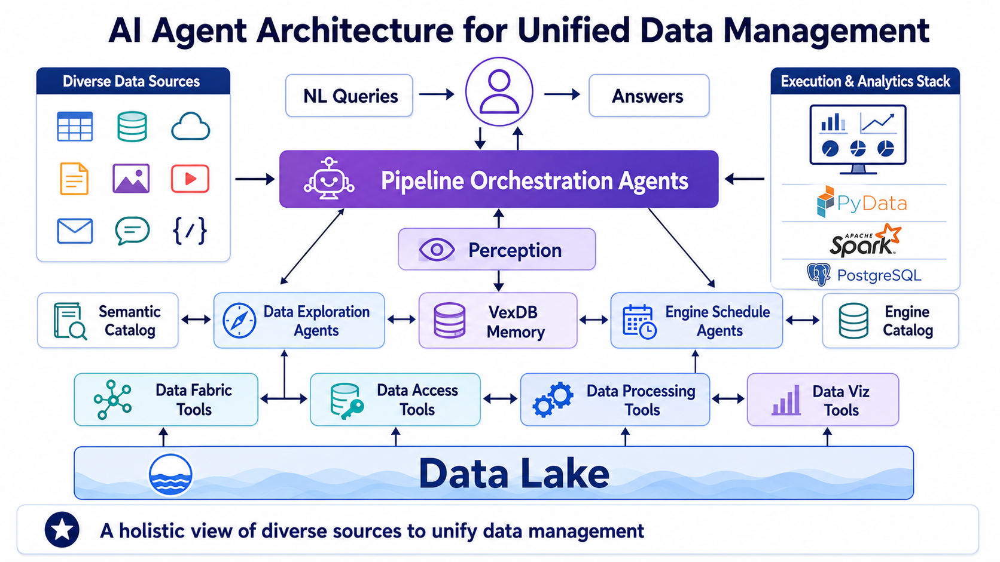
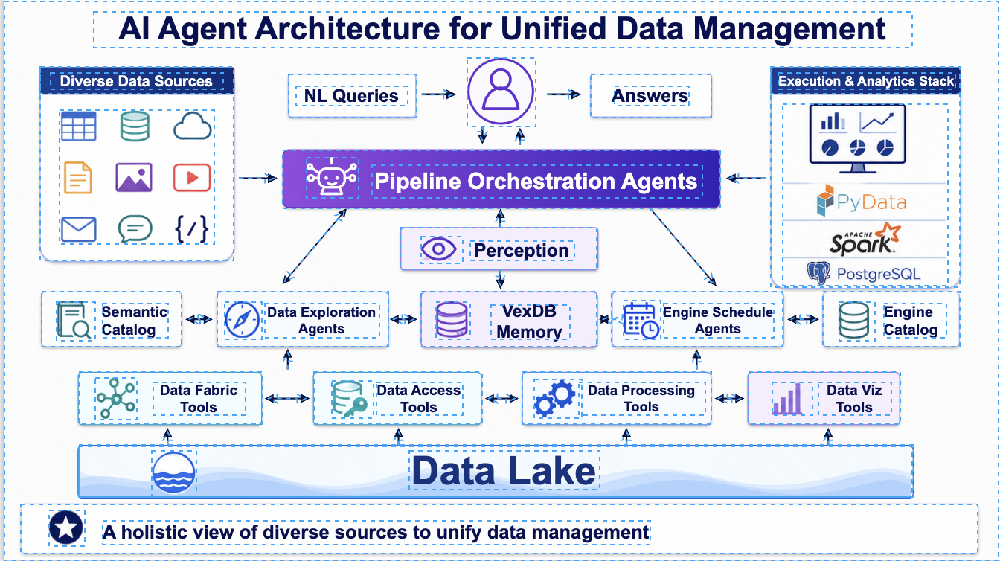
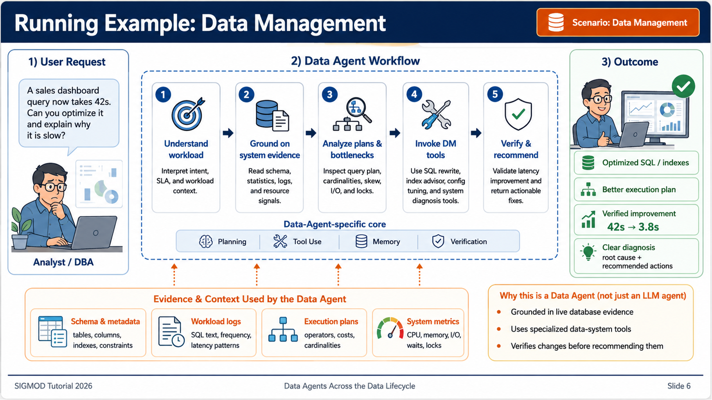
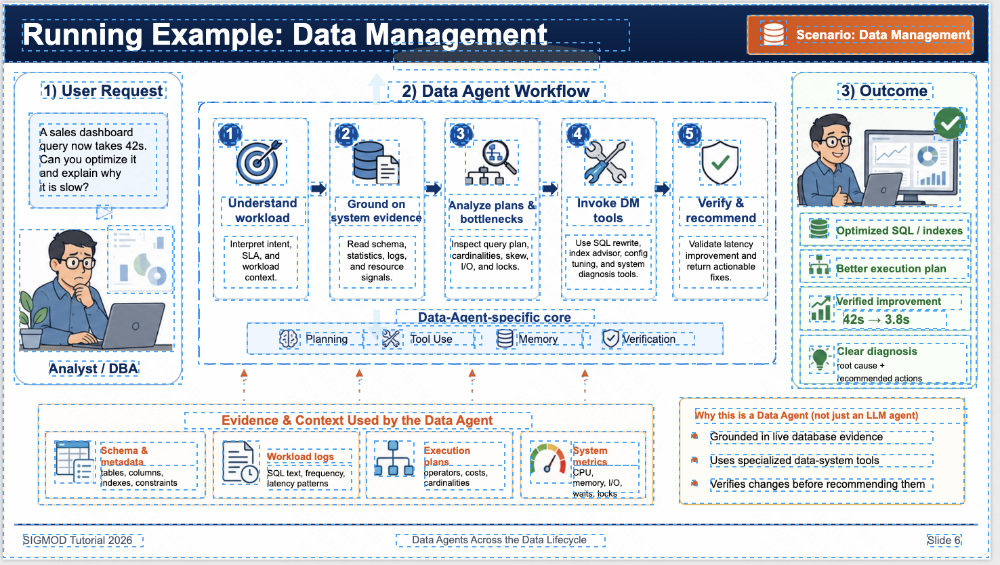
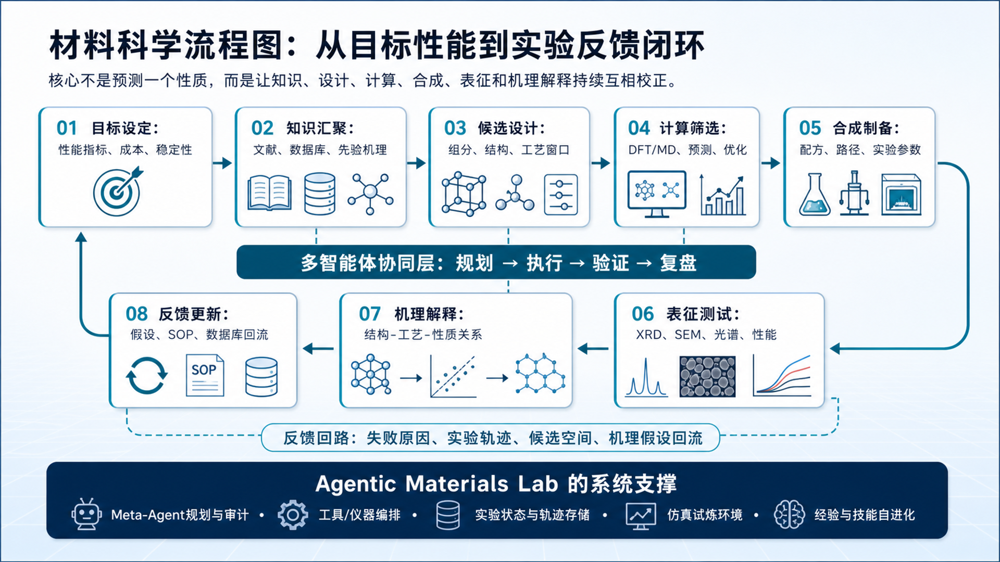
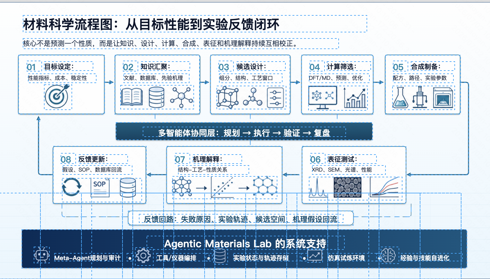

<div align="center">

# Draw.io Reconstruction Skill

[English](README.md) | [中文](README.zh-CN.md)

**A Codex skill for reconstructing diagram images into editable Draw.io files, with examples strongly recommended to be reproduced using Codex + GPT-5.5 xhigh.**

[](https://arxiv.org/abs/2605.15677)
[](https://huggingface.co/datasets/sxy1620348809/VCG-Bench)

</div>

This repository contains a Codex skill and helper scripts for converting reference diagram images into editable `.drawio` files. It is the practical reconstruction workflow used in the VCG-Bench release examples: an agent inspects a reference image, creates a visible-element inventory, rebuilds text and structure with Draw.io primitives, uses crops or SVG where appropriate, exports a PNG preview, and verifies the result. The bundled examples are packaged so others can reproduce them from the original PNG inputs. For faithful reproduction of the displayed examples, we strongly recommend using Codex + GPT-5.5 xhigh mode; weaker models or lower reasoning modes may not match the same visual fidelity.

The workflow uses two lightweight, independently reviewed repair loops. One clean Icon Producer prepares the icon set and a separate Icon Reviewer accepts or rejects it. Each FIX starts a fresh repair Producer on the current artifacts, followed by a fresh Reviewer. The complete reconstruction follows the same pattern. Review evidence is split into small `icons-review*.png` and `placement-review*.png` shards (at most eight icons each), with literal 1:1/2x views and surrounding source/final context. Reviewers must return one verdict per icon; Producers never accept their own work.

The companion benchmark repository is released at https://github.com/sxy1499894281/VCG-Bench.

## Recommended Reproduction Configuration

The example reconstructions in this repository are best reproduced with the following reference configuration:

- Runtime: Codex
- Model/mode: GPT-5.5 xhigh
- Input: the original image files (PNG/JPG) in `examples/`
- Output: editable `.drawio` files plus exported preview PNGs

This is the configuration we recommend for reproducing the README case images. Other runtimes, models, or lower reasoning settings can be used for experimentation, but they should not be treated as equivalent reproduction settings because they may miss small visual elements, drift in layout, or produce lower-fidelity Draw.io structure.

When reproducing, use the original image file in `examples/` as the source and export the preview to a separate file such as `examples/<name>_preview.png` so the original input remains unchanged.

## What Is Included

| Path | Purpose |
|---|---|
| `SKILL.md` | The Codex skill instructions. This is the file Codex reads when the skill is installed. |
| `scripts/batch_manifest.py` | Build a manifest for a folder of input images. |
| `scripts/batch_verify.py` | Validate a batch of `.drawio` outputs and exported previews. |
| `scripts/check_drawio.py` | Check `.drawio` XML structure, embedded images, and common reconstruction issues. |
| `scripts/export_drawio.py` | Export `.drawio` files to PNG using Draw.io Desktop/CLI. |
| `scripts/crop_assist.py` | Assist with extracting image crops from complex reference diagrams. |
| `agents/openai.yaml` | Example agent configuration metadata. |
| `examples/` | Original PNG/JPG inputs and example reconstructed `.drawio` files. |
| `assets/` | README case images. |

## Reconstruction Cases

The examples below show Codex + GPT-5.5 xhigh + skill reconstruction outputs after the required independent repair/review loops. The left image is the original diagram, and the right image is a README display copy of the exported PNG from the reconstructed `.drawio` file.

<table>
  <tr>
    <th width="50%">Original</th>
    <th width="50%">Reconstructed Draw.io Export</th>
  </tr>
  <tr>
    <td></td>
    <td></td>
  </tr>
  <tr>
    <td></td>
    <td></td>
  </tr>
  <tr>
    <td></td>
    <td></td>
  </tr>
  <tr>
    <td></td>
    <td></td>
  </tr>
  <tr>
    <td></td>
    <td></td>
  </tr>
  <tr>
    <td></td>
    <td></td>
  </tr>
  <tr>
    <td></td>
    <td></td>
  </tr>
</table>

Example source images and editable outputs are available at:

```text
examples/data_cn.jpg
examples/data_cn.drawio
examples/data_lake.png
examples/data_lake.drawio
examples/data_man.png
examples/data_man.drawio
examples/data_sci2.png
examples/data_sci2.drawio
examples/m1.png
examples/m1.drawio
examples/m2.png
examples/m2.drawio
examples/m3.png
examples/m3.drawio
```

## Installation As A Codex Skill

Copy or symlink this repository into your Codex skills directory:

```bash
mkdir -p ~/.codex/skills
ln -s /path/to/drawio-reconstruction-skill ~/.codex/skills/drawio-reconstruction
```

Then ask Codex to use `drawio-reconstruction` for a diagram image or a folder of images.

## Requirements

- Codex or another agent that can follow `SKILL.md`.
- Python 3.10+ for the helper scripts.
- Draw.io Desktop/CLI for exporting `.drawio` files to PNG.

macOS:

```bash
brew install --cask drawio
```

Ubuntu/Debian:

```bash
sudo apt update
sudo apt install drawio
```

If Draw.io is not auto-detected, pass the executable path to scripts that support it or set `DRAWIO_PATH`.

## Batch Workflow

Batch reconstruction uses one logical job per image and a bounded, rolling queue. Images beyond the available agent slots wait; as completed phase agents actually release capacity, the next eligible phase or image starts without waiting for a whole wave. Under tight limits the parent dispatches fresh role-specific agents directly, avoiding a full pool of coordinators waiting for child agents. Slot limits reduce throughput, not the required inventories, fidelity, or independent producer/reviewer repair loops. See [batch scheduling](references/batch-scheduling.md). The manifest helper records scope; the agent executes the scheduling protocol.

Create a manifest for a folder of images:

```bash
python scripts/batch_manifest.py path/to/images --output-dir path/to/output --write
```

For each manifest entry, the agent should create:

```text
<stem>.drawio
<stem>_preview.png
<stem>.audit.md
```

Verify the batch:

```bash
python scripts/batch_verify.py path/to/output/drawio_batch_manifest.json
```

Export a single `.drawio` file:

```bash
python scripts/export_drawio.py examples/data_lake.drawio examples/data_lake_preview.png
```

Check a `.drawio` file:

```bash
python scripts/check_drawio.py examples/data_lake.drawio
```

## Reconstruction Principles

The skill prioritizes visual fidelity to the reference image. It uses native Draw.io elements for editable text and structure, SVG or native shapes for simple icons, and image crops for complex, style-specific, or scene-like visual elements. Completion requires visual comparison against the reference, not only successful XML export.

Key quality gates:

- Every visible element should be inventoried before final delivery.
- Text and structural geometry should remain editable when practical.
- Complex artwork should be cropped or carefully repaired instead of replaced by generic icons.
- Exported PNG previews must be inspected for missing elements, crop seams, blur, and layout drift.
- The audit file should record unresolved defects instead of claiming perfect reconstruction.
- Icon preparation and complete-diagram review both start a fresh repair Producer on the current artifacts, followed by a different fresh read-only Reviewer.

## Relation To VCG-Bench

VCG-Bench studies visual-centric structured generation and editing with `mxGraph` XML. This skill is a practical agent workflow for one part of that problem: reconstructing high-fidelity editable Draw.io diagrams from reference images.

Relevant resources:

- Homepage: https://sxy1499894281.github.io/VCG-Bench/
- Paper: https://arxiv.org/abs/2605.15677
- Dataset: https://huggingface.co/datasets/sxy1620348809/VCG-Bench
- Code: https://github.com/sxy1499894281/VCG-Bench

## License

This skill repository is released under the [MIT License](LICENSE).

## Citation

If you use this skill or the companion benchmark in research, please cite VCG-Bench:

```bibtex
@misc{su2026vcgbenchunifiedvisualcentricbenchmark,
      title={VCG-Bench: Towards A Unified Visual-Centric Benchmark for Structured Generation and Editing}, 
      author={Xiaoyan Su and Peijie Dong and Zhenheng Tang and Song Tang and Yuyao Zhai and Kaitao Lin and Liang Chen and Gai Yuhang and Yuyu Luo and Qiang Wang and Xiaowen Chu},
      year={2026},
      eprint={2605.15677},
      archivePrefix={arXiv},
      primaryClass={cs.CL},
      url={https://arxiv.org/abs/2605.15677}, 
}
```

## Optional editable PowerPoint output

PPTX export is opt-in; ordinary reconstruction and all independent review gates remain unchanged.

- Request it upfront: “Reconstruct this image and also export an editable PPTX.” Conversion starts after all requested reconstructions and reviews finish.
- Request it later: “Convert the Draw.io you just created to editable PPTX.” The agent uses the current file, including manual edits, without reconstructing again.
- Say “No PPT, only Draw.io” to skip conversion; an unspecified preference also keeps the original output behavior.

This is an agent-assisted XML-to-native-PPTX workflow, not a universal one-command converter. Text, supported shapes and lines become native objects; icon images remain independent pictures unless explicitly converted further. The source Draw.io is preserved. PPTX authoring requires the available presentations skill/runtime; unsupported details are reported instead of silently flattening the diagram. See [conversion workflow](references/drawio-to-pptx.md).

Requested PPTX exports now use a PowerPoint/WPS compatibility profile by default: SVG picture assets become independent high-resolution transparent PNGs, embedded EOT fonts use the correct content type, and final-package compatibility checks are mandatory. This does not change Draw.io vector assets or flatten native text/structure. Format checks and actual Microsoft PowerPoint/WPS application tests are reported separately; untested software versions are not promised compatible.
